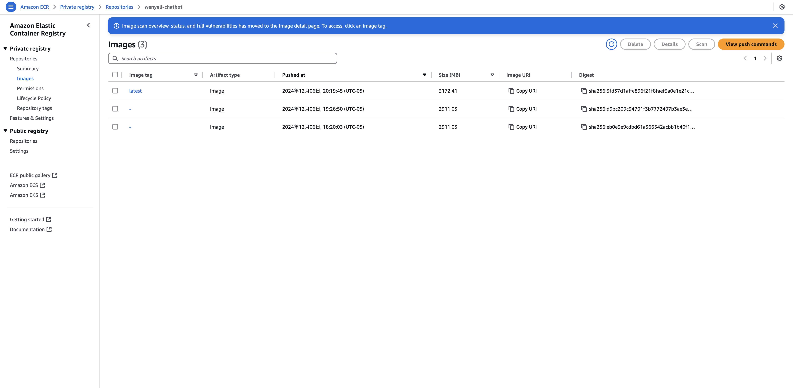
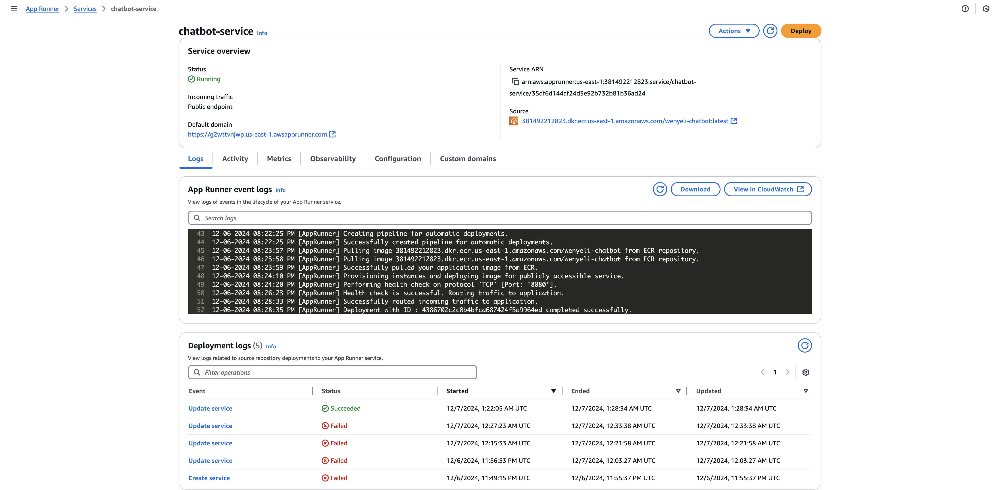
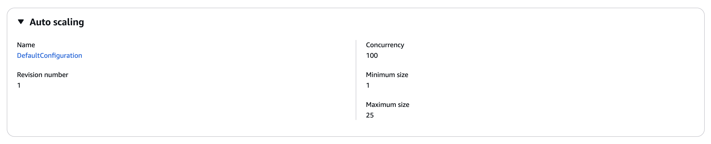

[](https://github.com/nogibjj/Wenye_Li_Individual_Project_3/actions/workflows/cicd.yml)

## Wenye Li Individual Project 3

### Video

[Demo on YouTube](https://youtu.be/EEg1Dv66DNE)

### Project Overview

This project implements an auto-scaling Flask application that integrates with TinyLlama through Ollama for natural language processing capabilities. The application provides a real-time chat interface and is deployed using AWS App Runner for automatic scaling.

### Local Development

```bash
# Install dependencies
make install

# Install and start Ollama
curl https://ollama.ai/install.sh | sh
ollama serve
ollama pull tinyllama

# Run application
make run-local
```

### Docker Deployment

```bash
# Build and run
make build
make run
```

### AWS Deployment

#### Download AWS CLI:

```bash
curl "https://awscli.amazonaws.com/awscli-exe-linux-x86_64.zip" -o "awscliv2.zip"
sudo apt-get update && sudo apt-get install -y unzip
unzip awscliv2.zip
sudo ./aws/install
```

#### Configure AWS CLI

```bash
aws configure
```

#### Push to ECR

```bash
aws ecr get-login-password --region us-east-1 | docker login --username AWS --password-stdin $AWS_ACCOUNT_ID.dkr.ecr.us-east-1.amazonaws.com
docker tag chatbot:latest $AWS_ACCOUNT_ID.dkr.ecr.us-east-1.amazonaws.com/chatbot:latest
docker push $AWS_ACCOUNT_ID.dkr.ecr.us-east-1.amazonaws.com/chatbot:latest
```

### Flask Application

- Real-time chat interface
- TinyLlama model integration via Ollama

### Use of DockerHub (Or equivalent)

Functioning container is held on both DockerHub and ECR.

```bash
docker pull wenyeli/chatbot
```



### AWS App Runner Deployment

https://g2wttvnjwp.us-east-1.awsapprunner.com/

The application is deployed using AWS App Runner, providing automatic scaling based on traffic.


